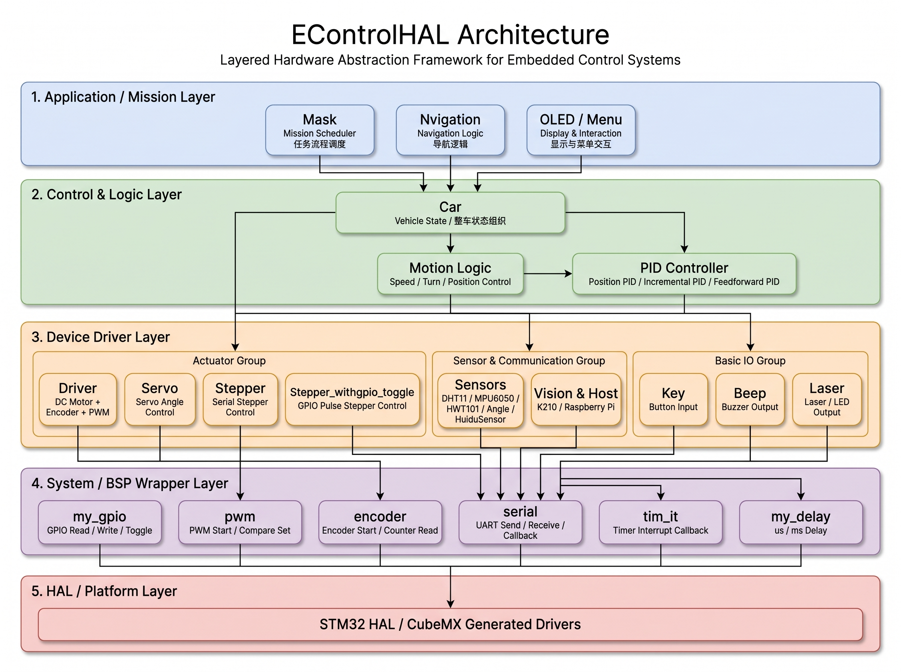
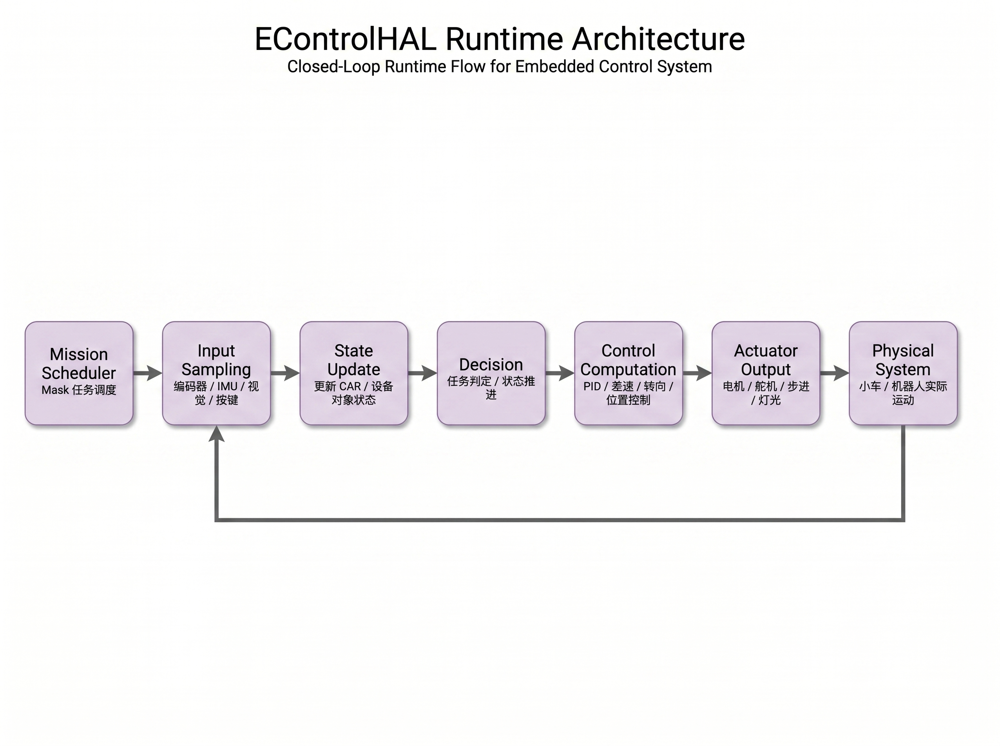

# EControlHAL

<p align="center">
  <br/>
  <strong>Engineering-Grade Hardware Abstraction Layer for Embedded Control Systems</strong>
  <br/>
  <br/>
  <span>面向电赛控制题、智能车、嵌入式机器人与多模块协同控制的工程化 HAL 框架</span>
  <br/>
  <br/>
</p>

<p align="center">
  <a href="https://github.com/roudking/Hardware_Abstract_Layer">
    
  </a>
  
  
  
</p>

<p align="center">
  
  
  
  
  
</p>

---

<p align="center">
  <a href="#-项目简介">项目简介</a> ·
  <a href="#-首页速览">首页速览</a> ·
  <a href="#-核心亮点">核心亮点</a> ·
  <a href="#-系统架构">系统架构</a> ·
  <a href="#-运行时数据流">运行时数据流</a> ·
  <a href="#-快速开始">快速开始</a> ·
  <a href="#-典型用法">典型用法</a> ·
  <a href="#-模块矩阵">模块矩阵</a> ·
  <a href="#-移植指南">移植指南</a>
</p>

---

## 🚀 项目简介

**EControlHAL** 是一个面向嵌入式控制工程的硬件抽象层与通用控制模块库。它主要服务于 **STM32 HAL / CubeMX** 工程体系，聚焦电赛控制题、智能车、移动机器人、传感器采集、视觉通信与复杂任务流程控制等场景。

它的目标不是简单收集外设例程，而是把控制类项目中反复出现的工程模式抽象出来，形成一套可复用的开发框架：

```text
底层外设封装  →  设备驱动模块  →  控制算法组合  →  任务流程调度
```

通过 EControlHAL，你可以更快地完成：

* 电机、舵机、步进电机等执行器控制；
* 编码器、IMU、灰度、角度、温湿度等传感器接入；
* K210 / K230 / Raspberry Pi 等外部智能模块通信；
* 基于 PID 的速度环、角度环、位置环控制；
* 面向比赛任务的流程编排与状态推进。

---

## ✨ 首页速览

<table>
  <tr>
    <td width="33%">
      <h3 align="center">🧱 Layered</h3>
      <p align="center">清晰的分层结构，将 HAL、BSP、驱动、控制和任务流程解耦。</p>
    </td>
    <td width="33%">
      <h3 align="center">⚙️ Modular</h3>
      <p align="center">电机、舵机、步进、传感器、通信模块按目录独立组织，可按需裁剪。</p>
    </td>
    <td width="33%">
      <h3 align="center">🏁 Competition-Oriented</h3>
      <p align="center">面向电赛控制题，内置任务流程调度机制，适合现场快速修改流程。</p>
    </td>
  </tr>
  <tr>
    <td width="33%">
      <h3 align="center">🧠 Control Ready</h3>
      <p align="center">封装位置式 PID、增量式 PID、前馈控制、输出限幅与积分限幅。</p>
    </td>
    <td width="33%">
      <h3 align="center">🔌 Hardware-Mapped</h3>
      <p align="center">通过 config 层集中管理端口、通道、定时器、极性等硬件差异。</p>
    </td>
    <td width="33%">
      <h3 align="center">🔁 Mission Flow</h3>
      <p align="center">使用 Mask 任务列表组织复杂动作序列，降低状态机维护成本。</p>
    </td>
  </tr>
</table>

---

## 🎯 核心亮点

### 1. 面向真实控制工程的分层设计

EControlHAL 按照工程实践中的职责边界组织代码：

| 层级                              | 作用                                   | 代表模块                                       |
| ------------------------------- | ------------------------------------ | ------------------------------------------ |
| **Application / Mission Layer** | 任务流程、整车行为、导航与交互                      | `Mask`、`Nvigation`、`OLED`                  |
| **Control & Logic Layer**       | 车辆状态组织、PID、差速控制、任务判定                 | `Car`、`PID`、`Motion Logic`                 |
| **Device Driver Layer**         | 电机、舵机、步进、传感器、通信模块                    | `Driver`、`Servo`、`Stepper`、`K210`、`HWT101` |
| **System / BSP Layer**          | GPIO、PWM、Encoder、UART、Timer、Delay 封装 | `System`                                   |
| **HAL / Platform Layer**        | STM32 HAL 与 CubeMX 生成代码              | `stm32xx_hal`、`gpio.h`、`tim.h`、`usart.h`   |

这种结构使项目在规模变大后仍然能够保持清晰的模块边界。

---

### 2. 配置与逻辑解耦

每个硬件模块尽量通过 `xxx_config.h / xxx_config.c` 管理硬件资源。例如电机模块的配置对象包含：

```c
typedef struct {
    TIM_HandleTypeDef *encoder_port;
    TIM_HandleTypeDef *pwm_port;
    int pwm_timer_autoreload;
    int channel[2];
    int encoder_polarity;
    int pwm_polarity;
} DRIVER_CONFIG;
```

业务逻辑只关心“电机对象”和“控制接口”，不需要在控制代码中散落大量定时器、通道、GPIO 等硬件细节。

---

### 3. 结构体对象化组织方式

EControlHAL 使用 C 语言结构体模拟对象化开发风格。例如电机对象：

```c
typedef struct
{
    DRIVER_CONFIG config;
    int targetspeed;
    int currentspeed;
    int flitspeed;
    int lastspeed;
    PID pid;
} MOTOR;
```

这种方式将一个设备的配置、状态、目标值、控制器参数统一管理，使多个同类设备可以通过相同接口创建与控制。

---

### 4. 控制算法内聚封装

`Driver/pid.h` 提供常用 PID 控制接口：

```c
PID_TYPE positionPid_Cal(PID_TYPE targetvalue, PID_TYPE currentvalue, PID* pid);
PID_TYPE positionFFPid_Cal(PID_TYPE targetvalue, PID_TYPE currentvalue, PID* pid);
PID_TYPE deltaPid_Cal(PID_TYPE targetvalue, PID_TYPE currentvalue, PID* pid);
PID_TYPE deltaFFPid_Cal(PID_TYPE targetvalue, PID_TYPE currentvalue, PID* pid);
void pidmemory_clear(PID* pid);
```

支持能力包括：

* 位置式 PID；
* 增量式 PID；
* 前馈 PID；
* 输出限幅；
* 积分限幅；
* PID 历史状态清零。

这使得速度环、角度环、位置环可以共享同一套控制器抽象。

---

### 5. Mask 任务流程解释器

`Mask` 是本仓库最具有工程特色的模块之一。它将复杂流程从传统的大量 `if-else` 状态机改写为任务序列：

```c
MASK mask_start = {
    .mask_list = {
        stop,
        yled,
        get_num,
        nled,
        yled,
        get_mode,
        nled,
        mask_load
    },
    .mask_num = 8,
};
```

每个任务节点返回：

```text
0  → 当前任务未完成，下次继续执行
1  → 当前任务完成，任务指针进入下一个节点
```

这让比赛流程修改变得非常直接：只需要调整任务数组，而不必重写整套状态机。

---

## 🧭 系统架构

下面是 EControlHAL 的工程级架构图，展示了从任务层到 HAL 层的完整分层关系、核心模块与主要依赖路径。

<p align="center">
  
</p>

---

## 🔁 运行时数据流

下面是 EControlHAL 的运行时闭环控制流程图，展示了从任务调度、输入采样、状态更新、决策判断、控制计算到执行器输出的完整反馈链路。

<p align="center">
  
</p>

典型闭环流程可以理解为：

```text
任务调度 → 采集反馈 → 更新状态 → 判断任务 → 计算控制量 → 输出执行量 → 物理系统反馈
```

---

## 📁 项目目录结构

```text
EControlHAL
├── .vscode/                    # VS Code 工程配置
├── Angle_adc/                  # 基于 ADC 的角度测量模块
├── Angle_pwm/                  # 基于 PWM / 输入捕获的角度测量模块
├── Beep/                       # 蜂鸣器模块
├── DHT11/                      # DHT11 温湿度传感器
├── Driver/                     # 直流电机、编码器、PWM、PID 闭环
├── HuiduSensor/                # 灰度传感器
├── HWT101/                     # HWT101 姿态模块
├── K210/                       # K210 视觉识别串口通信
├── Key/                        # 按键模块
├── Laser/                      # 激光 / LED GPIO 输出模块
├── Mask/                       # 任务流程调度层
├── MPU6050/                    # MPU6050 传感器与姿态处理
├── Nvigation/                  # 导航相关逻辑
├── OLED/                       # OLED 显示与菜单系统
├── Raspberry_Pi/               # 树莓派串口通信
├── Servo/                      # 舵机控制
├── Stepper/                    # 串口步进电机
├── Stepper_withgpio_toggle/    # 基于 GPIO 脉冲的步进电机控制
├── System/                     # 底层 BSP / HAL 封装
├── docs/
│   └── assets/
│       ├── econtrolhal-architecture.png
│       └── econtrolhal-runtime-architecture.png
└── README.md
```

---

## ⚡ 快速开始

### 1. 克隆仓库

```bash
git clone -b hal_stm_version https://github.com/roudking/Hardware_Abstract_Layer.git
```

或直接克隆默认分支：

```bash
git clone https://github.com/roudking/Hardware_Abstract_Layer.git
```

---

### 2. 准备 STM32 工程

EControlHAL 推荐作为模块库集成到已有 STM32 工程中。

典型流程：

```text
创建 CubeMX 工程
    ↓
配置 GPIO / TIM / PWM / Encoder / UART / I2C
    ↓
生成 Keil / STM32CubeIDE / Makefile 工程
    ↓
复制需要的 EControlHAL 模块目录
    ↓
添加 .c 文件与 Include Path
    ↓
修改 xxx_config.c / xxx_config.h
    ↓
在 main.c 或用户任务中调用模块接口
```

---

### 3. 按需选择模块

根据项目需求选择对应模块即可，不必一次性引入整个仓库。推荐按下表裁剪：

| 使用场景       | 推荐引入目录                                                                                 | 说明                                            |
| ---------- | -------------------------------------------------------------------------------------- | --------------------------------------------- |
| 仅使用底层封装    | `System/`                                                                              | GPIO、PWM、Encoder、UART、Timer、Delay 等基础 BSP 封装。 |
| 使用直流电机闭环   | `System/`、`Driver/`                                                                    | 适用于编码器测速、PWM 输出和 PID 速度闭环控制。                  |
| 使用舵机控制     | `System/`、`Servo/`                                                                     | 适用于舵机 PWM 初始化与角度控制。                           |
| 使用完整小车控制框架 | `System/`、`Driver/`、`Servo/`、`Key/`、`Laser/`、`HWT101/`、`K210/`、`Raspberry_Pi/`、`Mask/` | 适用于包含底盘控制、姿态反馈、视觉通信、按键输入、灯光输出和任务流程调度的完整控制类项目。 |

> 建议从最小模块组合开始接入，确认编译和外设初始化正常后，再逐步加入传感器、通信和任务调度模块。

---

## 🧩 典型用法

### 示例 1：直流电机闭环速度控制

```c
#include "Driver.h"

MOTOR left_motor;
MOTOR right_motor;

PID left_pid = {
    .kp = 170.5,
    .ki = 43.0,
    .kd = 0.0,
    .out_xianfu = 7199.0
};

PID right_pid = {
    .kp = 180.5,
    .ki = 43.0,
    .kd = 0.0,
    .out_xianfu = 7199.0
};

void Motor_UserInit(void)
{
    Driver_creatmotor(&left_motor, left_pid, leftdriver);
    Driver_creatmotor(&right_motor, right_pid, rightdriver);

    Driver_init(&left_motor);
    Driver_init(&right_motor);
}

void Motor_ControlLoop(void)
{
    Driver_getmotor_currentspeed(&left_motor);
    Driver_getmotor_currentspeed(&right_motor);

    Driver_setmotor_targetspeed(&left_motor, 30);
    Driver_setmotor_targetspeed(&right_motor, 30);

    Driver_setspeed(&left_motor, &right_motor);
}
```

建议将 `Motor_ControlLoop()` 放入固定周期任务中，例如 10 ms 或 20 ms 定时器任务。实际周期应与编码器计数方式、速度单位和 PID 参数整定保持一致。

---

### 示例 2：舵机角度控制

```c
#include "Servo.h"

SERVO servo;

void Servo_UserInit(void)
{
    Servo_create(&servo, servo_config);
    Servo_init(&servo);
}

void Servo_Test(void)
{
    Servo_setangle(&servo, 90.0f);
}
```

---

### 示例 3：按键读取

```c
#include "Key.h"

KEY key;

void Key_UserInit(void)
{
    Key_create(&key, key1_config);
}

void Key_UserLoop(void)
{
    Key_read(&key);

    if (key.pin_value == 1) {
        // active level detected
    }
}
```

---

### 示例 4：蜂鸣器与激光 / LED 控制

```c
#include "Beep.h"
#include "Laser.h"

BEEPER beeper;
LASER laser;

void IO_UserInit(void)
{
    Beep_create(&beeper, beep_config);
    Laser_create(&laser, laser_config);
}

void IO_Test(void)
{
    Beep_on(&beeper);
    Laser_on(&laser);

    // ...

    Beep_off(&beeper);
    Laser_off(&laser);
}
```

---

### 示例 5：Mask 任务流程调度

```c
#include "Mask.h"

MASK demo_mask = {
    .mask_list = {
        stop,
        wait_keyoff,
        goto_T,
        go_over,
        turnright,
        goto_N,
        stop
    },
    .mask_num = 7
};
```

任务节点返回值含义：

```text
return 0  → 当前动作未完成，继续执行当前节点
return 1  → 当前动作完成，进入下一个节点
```

调度示例：

```c
void User_MissionInit(void)
{
    Car_setmask(&car, demo_mask);
}

void User_MissionLoop(void)
{
    Mask_performmasks(&car);
}
```

---

## 🧱 模块矩阵

| 模块                        | 层级               | 功能定位            | 典型依赖                            |
| ------------------------- | ---------------- | --------------- | ------------------------------- |
| `System/my_gpio`          | BSP              | GPIO 读写与翻转      | STM32 GPIO HAL                  |
| `System/pwm`              | BSP              | PWM 启动与比较值设置    | TIM PWM                         |
| `System/encoder`          | BSP              | 编码器启动、计数读取、清零   | TIM Encoder                     |
| `System/serial`           | BSP              | UART 发送、接收、中断回调 | UART HAL                        |
| `System/tim_it`           | BSP              | 定时器中断启动与回调注册    | TIM Base IT                     |
| `Driver`                  | Device / Control | 直流电机闭环控制        | PWM、Encoder、PID                 |
| `Servo`                   | Device           | 舵机角度控制          | PWM                             |
| `Stepper`                 | Device           | 串口步进电机控制        | UART                            |
| `Stepper_withgpio_toggle` | Device           | GPIO 脉冲式步进控制    | GPIO、Timer IT                   |
| `Key`                     | Device           | 按键输入            | GPIO                            |
| `Beep`                    | Device           | 蜂鸣器输出           | GPIO                            |
| `Laser`                   | Device           | 激光 / LED 输出     | GPIO                            |
| `MPU6050`                 | Sensor           | 姿态数据与 Kalman 处理 | IIC / Serial / Delay            |
| `HWT101`                  | Sensor           | 姿态角与 yaw 角反馈    | UART                            |
| `DHT11`                   | Sensor           | 温湿度采集           | GPIO、Delay                      |
| `K210`                    | Communication    | 视觉识别结果接收        | UART、cJSON                      |
| `Raspberry_Pi`            | Communication    | 模式与控制命令交互       | UART、cJSON                      |
| `Mask`                    | Application      | 任务流程调度          | Car、Driver、Sensor、Communication |

---

## 🛠️ 移植指南

### Step 1：优先适配 System 层

新工程中最先检查：

```text
my_gpio.c/h
pwm.c/h
encoder.c/h
serial.c/h
tim_it.c/h
my_delay.c/h
```

这部分是上层所有模块的基础。

---

### Step 2：修改模块配置层

重点检查：

* GPIO 端口与引脚；
* PWM 定时器与通道；
* Encoder 定时器；
* UART 句柄；
* 舵机角度范围；
* 电机方向极性；
* 输出限幅；
* 中断周期。

推荐把硬件相关信息集中写在：

```text
xxx_config.h
xxx_config.c
```

---

### Step 3：接入业务逻辑

推荐调用顺序：

```text
创建设备对象
    ↓
初始化底层外设
    ↓
周期读取反馈
    ↓
计算控制量
    ↓
输出执行量
```

电机控制示例流程：

```text
Driver_creatmotor()
→ Driver_init()
→ Driver_getmotor_currentspeed()
→ Driver_setmotor_targetspeed()
→ Driver_setspeed()
```

任务流程示例：

```text
Car_setmask()
→ Mask_performmasks()
→ Car_xxxfuc()
→ mask_pc 自动推进
```

---

## 🧪 适用场景

EControlHAL 适合：

* 全国大学生电子设计竞赛控制类题目；
* 巡线车、差速车、配送车、移动机器人；
* STM32 + K210 / K230 / Raspberry Pi 协同控制；
* 多传感器反馈控制系统；
* 需要快速搭建任务流程的控制工程；
* 课程设计、实验项目、比赛原型系统。

---

## ⚠️ 注意事项

1. **本仓库是模块库，不是完整可直接烧录的 CubeMX 工程。** 需要接入你自己的 STM32 工程后使用。
2. **当前实现主要依赖 STM32 HAL。** 若迁移到其他平台，需要重新实现 `System` 层接口。
3. **PID 参数必须重新整定。** 仓库中的参数更适合作为参考，实际项目应结合电机、电源、负载和控制周期重新调整。
4. **串口回调分发需要结合工程补全。** 不同工程使用的 USART 实例不同，务必检查 `serial.c` 中的回调注册和分发逻辑。
5. **定时器中断周期会直接影响控制效果。** 编码器测速、PID 控制、步进脉冲和任务调度都依赖稳定周期。
6. **Mask 是项目级任务调度层。** 如果只需要底层驱动，可以不引入 `Mask`；如果使用完整任务流，需要确保依赖模块全部接入。

---

## 🗺️ Roadmap

* [ ] 提供完整 STM32CubeMX 示例工程；
* [ ] 为主要模块补充最小可运行 Demo；
* [ ] 完善串口回调机制，支持更多 UART 实例；
* [ ] 增加每个模块的 API 文档；
* [ ] 为 Mask 任务系统补充流程图与状态机说明；
* [ ] 优化跨平台抽象能力，支持更多 MCU；
* [ ] 增加 CI / 静态检查 / 代码风格规范；
* [ ] 补充开源 License。

---

## 🤝 Contributing

欢迎围绕以下方向贡献：

* 新增常用执行器或传感器驱动；
* 优化控制算法接口；
* 补充模块级 Demo；
* 改进文档与注释；
* 提升不同 STM32 系列间的兼容性；
* 优化任务流程调度机制。

建议提交前遵循：

```text
接口风格统一
配置与逻辑分离
模块尽量独立
新增模块附带使用说明
尽量避免在业务逻辑中硬编码硬件信息
```

---

## 📄 License

本项目基于 MIT License 开源，详情请参见 [LICENSE](./LICENSE) 文件。

---

## 🙌 Acknowledgements

EControlHAL 来源于嵌入式控制、电赛控制题、小车系统与多模块联调实践。它的目标不是成为一个“外设例程合集”，而是沉淀一套真正适合控制类工程快速开发、复用和维护的代码框架。

<p align="center">
  <strong>If this project helps you, please consider giving it a ⭐ Star.</strong>
</p>
